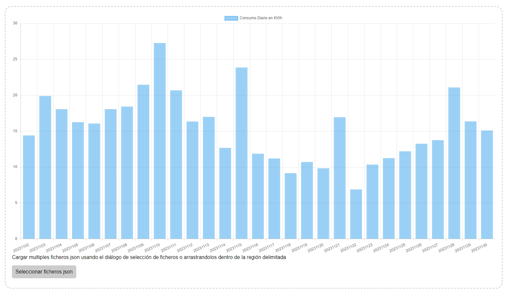

UFD scraper
===========

### Acerca de este proyecto

UFD scraper es un cliente de acceso a la API web interna de Union Fenosa Distribución (api.ufd.es), obtenido aplicando
un poco de ingeniería inversa a su portal web oficial (https://areaprivada.ufd.es/).

Su propósito es que el usuario pueda consultar, sin recibir errores de “Servicio no disponible, inténtelo de nuevo más
tarde”, los datos de su contrato particular sobre el consumo de energía distribuida a través de las redes eléctricas
**estatales** controladas por esta compañía, propiedad de Naturgy (antes Gas Natural), actualmente controlada por la
fundación bancaria “[Puertas Giratorias](
https://www.yoibextigo.lamarea.com/informe/caixabank/quienes-son/fichajes-y-estrellas-la-caixa/)", uhm, quiero decir,
"La Caixa”. 

Este software y su código fuente se distribuyen gratuitamente, de buena fe y sin ánimo de lucro, con condiciones de
acuerdo a la [LICENCIA](LICENCIA) incluida. Desconozco si su uso puede violar alguna de las condiciones de servicio, o
alguno de los cambios en las mismas que imponen unilateralmente a discreción y decretazo. Personalmente no dispongo de
un ejército de abogados para confirmarlo o desmentirlo. En cualquier caso recomiendo precaución y no me responsabilizo
de su uso o abuso, debido o indebido, así como de ninguna consecuencia esperada o inesperada de su correcto o incorrecto
funcionamiento.

### Por qué tiene que existir algo así

El portal oficial de consulta en https://areaprivada.ufd.es/ es, deliberadamente o no, difícilmente utilizable en su
estado actual (12/2021):

 - La opción de descarga de todo el histórico de consumo siempre da error.
 - Al poco tiempo de acceder, la aplicación a menudo pierde la sesión con el servidor de datos y todas las consultas dan
error. La única solución suele ser cerrar la sesión y abrir una nueva para poder continuar realizando consultas _(A
veces recargar la página también funciona)_
 - Además, el límite en la velocidad de consultas es excepcionalmente bajo, y el número de consultas redundantes
innecesarias que realiza la aplicación es muy elevado: La unión de ambas condiciones obliga a hacer las consultas con
cuentagotas, o el servidor restringirá el acceso temporalmente hasta que hayan pasado unos minutos desde la última
consulta.
 - Por último, pero no menos importante para nerds de la autoproducción: el servicio no dispone de datos sobre energía
generada para el autoconsumo no vertida a la red. Para calcular el total de energía consumida es necesario poner un
medidor por cuenta propia en el cuadro eléctrico donde se unen ambas fuentes. En una instalación fotovoltaica sin
contador de vertido es típico tener únicamente medidores de producción en el inversor y de consumo de la red en el
contador. En resumen: no queda otra que consultar las medidas de cada fuente independientemente y sumarlas para obtener
el consumo total de la instalación.

### Uso

Estos son los pasos necesarios para desplegar el servicio localmente en tu ordenador personal sin que sea accesible
desde ningún otro dispositivo (Esta guía asume ciertos conocimientos de informática relativamente especializados):

 1. Descargar e instalar [git](https://git-scm.com/downloads).
 2. Descargar e instalar [docker](https://www.docker.com/products/docker-desktop/).
 3. Clonar el repositorio ejecutando el comando `git clone https://github.com/anothersatisfiedcustomer/ufdscraper` en el
directorio deseado.
 4. Correr el cliente de consulta ejecutando, dentro del directorio en el que se encuentra el fichero
    `docker-compose.yml`, en la linea de comandos de Windows el comando
   `set "START_DATE=<inicio_consulta_aaaammdd>" && set "END_DATE=<fin_consulta_aaaammdd>" && set "USER=<usuario_ufd>" && set "PASSWORD=<password_ufd>" && docker compose up`;
   o, en un intérprete de comandos bash,
   `USER="<usuario_ufd>" PASSWORD="<password_ufd>" START_DATE="<inicio_consulta_aaaammdd>" END_DATE="<fin_consulta_aaaammdd>" docker compose up`.
   Si `START_DATE` y `END_DATE` no son provistos se tomaran los valores del primer al último dia del mes previo al mes
   en curso.
 5. Abrir [chart.html](chart.html) en el navegador y arrastrar a la zona delimitada en la página el/los fichero(s)
    `.json` generados en la carpeta [output](output)
    
Se mostrarán 2 graficos: Uno con el consumo acumulado de cada dia, y el otro con el consumo de cada hora de cada dia.

Mantener pulsada la tecla CONTROL permitirá hacer zoom sobre el período mostrado en el gráfico usando la rueda del
ratón. El mismo resultado es posible mediante una seleccion haciendo click con el botón izquierdo del ratón y
arrastrando a lo largo del rango deseado.

Mantener pulsada la tecla SHIFT permite desplazar hacia la izquierda o derecha el rango seleccionado, haciendo click con
el botón izquierdo del ratón y arrastrando el gráfico hacia la izquierda o derecha según se desee mover el rango.

El boton `Descargar CSV` bajo cada gráfico permite descargarse los datos en formato CSV (P.ej. para importar en Excel).

### Otras notas

Cuando escribi este codigo `api.ufd.es` no empleaba una CA convencional reconocida con un certificado de firma en el
almacén de certificados raíz de python por defecto. La validación de su certificado se puede por tanto desactivar con
el parametro `--no-ssl-verify`.

`api.ufd.es` ha introducido recientemente soporte de autenticación de 2 factores. Este código no la soporta pero debería
ser relativamente fácil de añadir.

El sistema de autenticación de `api.ufd.es` está basado en un token con una función de refresco que debería llamarse
periódicamente para evitar que caduque. En su lugar este código vuelve a enviar el usuario y el password cada cierto
tiempo (por defecto si han pasado más de 60 segundos desde la última autenticación) para generar un nuevo token, lo cual
es menos eficiente y convencional y podría resultar en una restricción temporal del servicio por exceso de
autenticaciones, aunque de momento no me he encontrado ningún problema con ello.

Por defecto cada consulta obtiene los datos de consumo por horas de un único día, y se introduce un retardo aleatorio
entre consultas de 2 a 4 segundos, lo cual significa que en media la ejecución para un rango de N dias tardará unos
3 x N segundos en completarse.

### Lista de cambios

#### 12/2021 v0.1.0 - alias _corrupción escalable_

 - Primera versión pública
