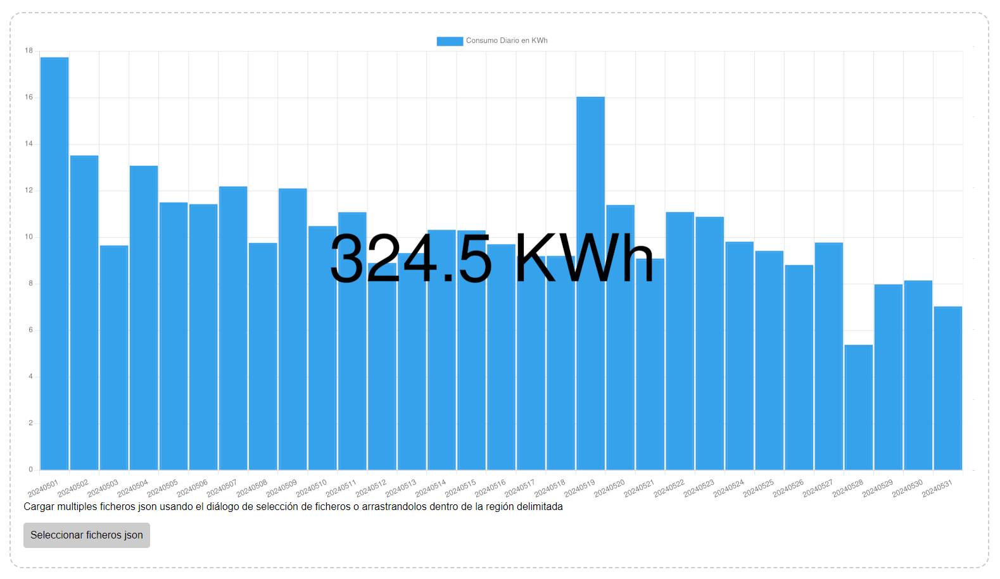

UFD scraper
===========


### Acerca de este proyecto

UFD scraper es un cliente de acceso a la API web interna de Union Fenosa Distribución (api.ufd.es), obtenido aplicando
un poco de ingeniería inversa a su portal web oficial (https://areaprivada.ufd.es/).

Su propósito es que el usuario pueda consultar, sin recibir errores de “Servicio no disponible, inténtelo de nuevo más
tarde”, los datos de su contrato particular sobre el consumo de energía distribuida a través de las redes eléctricas
**estatales** controladas por esta compañía, propiedad de Naturgy (antes Gas Natural), actualmente controlada por la
fundación bancaria “[Puertas Giratorias](
https://www.yoibextigo.lamarea.com/informe/caixabank/quienes-son/fichajes-y-estrellas-la-caixa/)", uhm, perdón, quise
decir, "La Caixa”. 

Este software y su código fuente se distribuyen gratuitamente, de buena fe y sin ánimo de lucro, con condiciones de
acuerdo a la [LICENCIA](LICENCIA) incluida. Desconozco si su uso puede violar alguna de las condiciones de servicio, o
alguno de los cambios en las mismas que imponen unilateralmente a discreción y decretazo. No dispongo de un ejército
personal de abogados para confirmarlo o desmentirlo. En cualquier caso recomiendo precaución y no me responsabilizo
de su uso o abuso, debido o indebido, así como de ninguna consecuencia esperada o inesperada de su correcto o incorrecto
funcionamiento.


### Por qué tiene que existir algo así

El portal oficial de consulta en https://areaprivada.ufd.es/ es, deliberadamente o no, difícilmente utilizable en su
estado actual (12/2021):

 - La opción de descarga de todo el histórico de consumo siempre da error.
 - Al poco tiempo de acceder, la aplicación a menudo pierde la sesión con el servidor de datos.
A partir de ahi y todas las consultas dan error. La única solución suele ser cerrar la sesión y abrir una nueva para
poder continuar realizando consultas _(A veces recargar la página también funciona)_
 - El límite en la velocidad de consultas es excepcionalmente bajo
Unido a que el número de consultas redundantes innecesarias que realiza la aplicación es muy elevado esto obliga a hacer
las consultas con cuentagotas, o el servidor restringirá el acceso temporalmente hasta que hayan pasado unos minutos
desde la última consulta.
 - El servicio no dispone de datos sobre energía generada no vertida a la red.
Para quien tenga una instalación solar o algún otro sistema de autoproducción conectado a la red, calcular el total de
energía consumida es necesario poner un medidor por cuenta propia en el cuadro eléctrico donde se unen ambas fuentes.
En una instalación fotovoltaica sin contador de vertido es típico tener únicamente medidores de producción en el
inversor, y de consumo de la red en el contador. En resumen: no queda otra que consultar las medidas de cada fuente
independientemente y sumarlas para obtener el consumo total de la instalación.


### Uso

> [!IMPORTANT]
> ATENCIÓN!!! UFD desactiva el servicio de consultas de consumo de su API durante la noche. Si después de autenticarse
> y obtener la información de la subscripción correctamente el script devuelve un código de error `` en la consulta,
> deberá reintentarse la ejecución en horario diurno (P. ej. de Lunes a Viernes entre las 9am y las 5pm hora Española
> UTC+1)

Estos son los pasos necesarios para desplegar el servicio localmente en tu ordenador personal sin que sea accesible
desde ningún otro dispositivo (Esta guía asume ciertos conocimientos de informática relativamente especializados):

1. Descargar e instalar [git](https://git-scm.com/downloads).
2. Descargar e instalar [docker](https://www.docker.com/products/docker-desktop/).
3. Descargar este repositorio `git clone https://github.com/anothersatisfiedcustomer/ufdscraper`
4. Correr el cliente de consulta:

Windows:
```batch
set "START_DATE=<inicio_consulta_aaaammdd>" && set "END_DATE=<fin_consulta_aaaammdd>" && set "USER=<usuario_ufd>" && set "PASSWORD=<password_ufd>" && docker compose up
```
Bash:
```bash
USER="<usuario_ufd>" PASSWORD="<password_ufd>" START_DATE="<inicio_consulta_aaaammdd>" END_DATE="<fin_consulta_aaaammdd>" docker compose up
```
Si `START_DATE` y `END_DATE` no son provistos se tomaran los valores del primer al último dia del mes previo al mes
en curso.

5. Abrir [chart.html](chart.html) en el navegador
6. Arrastrar a la zona delimitada en la página el/los fichero(s) `.json` generados en la carpeta [output](output)
    
Se mostrarán 2 gráficos: Uno con el consumo acumulado de cada dia, y el otro con el consumo de cada hora de cada día.

Mantener pulsada la tecla CONTROL permitirá hacer zoom sobre el período mostrado en el gráfico usando la rueda del
ratón. El mismo resultado es posible mediante una selección haciendo click con el botón izquierdo del ratón y
arrastrando a lo largo del rango deseado.

Mantener pulsada la tecla SHIFT permite desplazar hacia la izquierda o derecha el rango seleccionado, haciendo click con
el botón izquierdo del ratón y arrastrando el gráfico hacia la izquierda o derecha según se desee mover el rango.

El botón `Descargar CSV` bajo cada gráfico permite descargarse los datos en formato CSV (P.ej. para importar en Excel).

#### Ingesta en InfluxDB

El script [influxdbloader.py](influxdbloader/influxdbloader.py) permite ingerir el JSON de salida en una base
de datos influx db. (`python influxdbloader/influxdbloader.py --help` para mas info)

El fichero [docker-compose.yml](docker-compose.yml) contiene las variables de entorno de configuración necesarias para
correr este script mediante el comando `docker compose up -d`, incluyendo la definicion de un stack grafana/influxdb
local como posible destino de la ingesta.

### Otras notas

Cuando escribí este código `api.ufd.es` no empleaba una CA convencional reconocida con un certificado de firma en el
almacén de certificados raíz de python por defecto. La validación de su certificado se puede por tanto desactivar con
el parametro `--no-ssl-verify`.

`api.ufd.es` ha introducido recientemente soporte de autenticación de 2 factores. Este código no la soporta pero debería
ser relativamente fácil de añadir.

El sistema de autenticación de `api.ufd.es` está basado en un token con una función de refresco que debería llamarse
periódicamente para evitar que caduque. En su lugar este código vuelve a enviar el usuario y el password cada cierto
tiempo (por defecto si han pasado más de 60 segundos desde la última autenticación) para generar un nuevo token, lo cual
es menos eficiente y convencional y podría resultar en una restricción temporal del servicio por exceso de
autenticaciones, aunque de momento no me he encontrado ningún problema con ello.

Por defecto cada consulta obtiene los datos de consumo por horas de un único día, y se introduce un retardo aleatorio
entre consultas de 2 a 4 segundos, lo cual significa que en media la ejecución para un rango de N dias tardará unos
3 x N segundos en completarse.

### Lista de cambios

#### 01/2025 v0.2.0 - alias _corrupción en miami_

 - Añade script [influxdbloader.py](influxdbloader/influxdbloader.py) para ingerir la salida de
[ufdscraper.py](ufdscraper/ufdscraper.py) en una base de datos InfluxDB.

 - Vuelca a JSON lines en lugar de JSON, para mejor escalabilidad tanto en la generación de la salida como en su
ingesta. **ESTO ROMPE LA COMPATIBILIDAD HACIA ATRÁS CON ARCHIVOS GENERADOS POR LA VERSION ANTERIOR**. El script
[2_to_3_output.py](2_to_3_output.py) permite convertir estos archivos a la nueva version.

#### 12/2021 v0.1.0 - alias _corrupción escalable_

 - Primera versión pública
